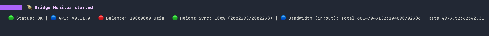
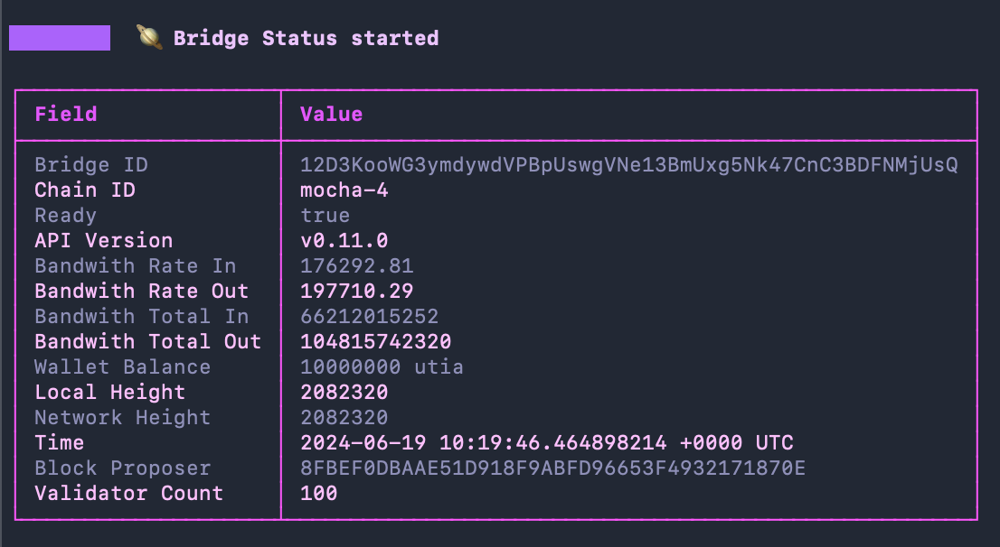
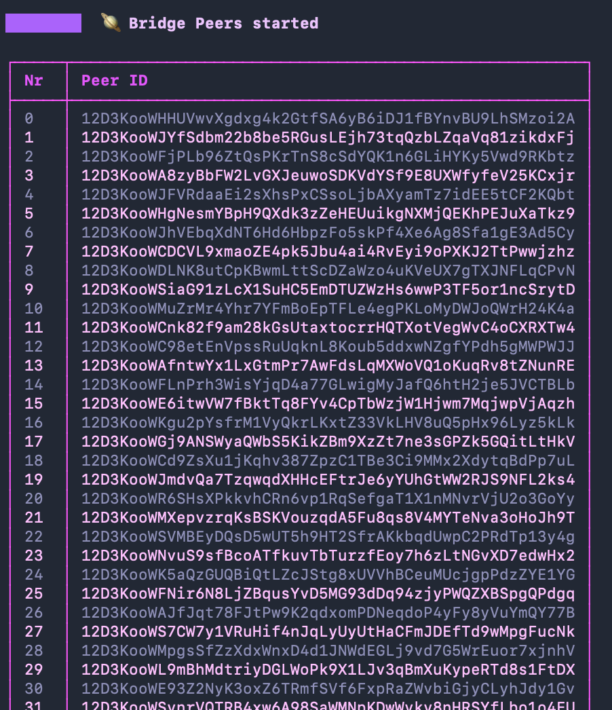
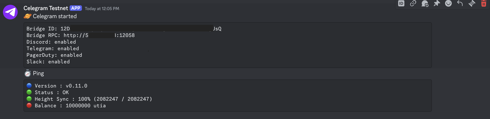
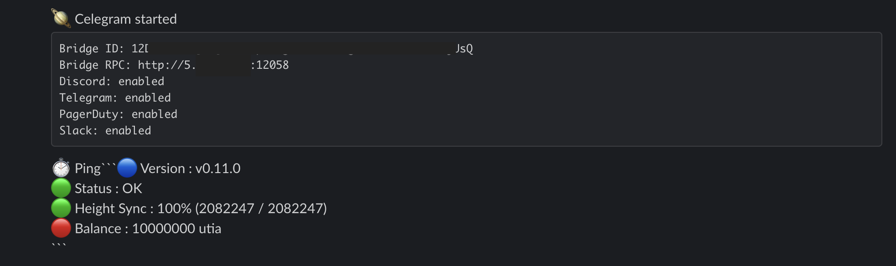
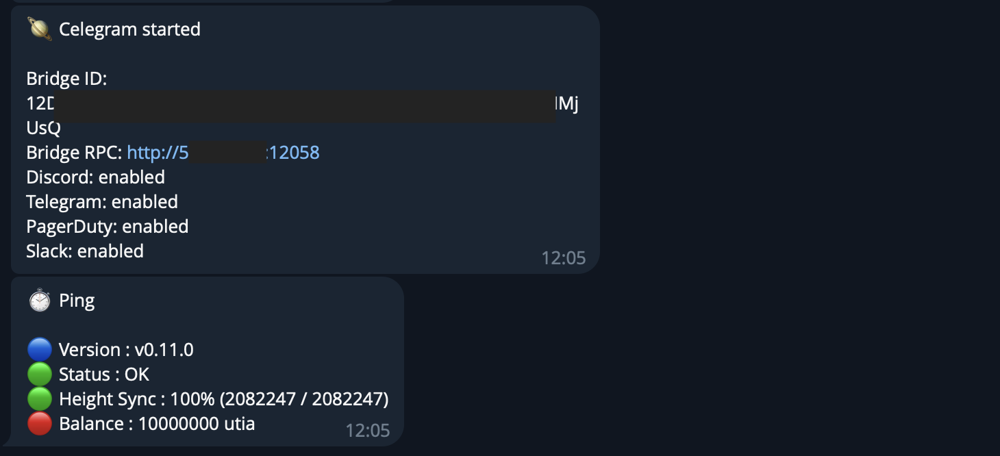

# 🪐 Celegram - Celestia Bridge Monitoring

Celegram, a monitoring CLI tool for your Celestia bridge node.
<br/>


# Description

Celegram is a monitoring and alerting tool for Celestia bridge nodes, it aims to be simple to install and use, and useful in features provided.

Celegram displays your bridge node info via several communication channels: Discord, Telegram, PagerDuty and Slack. It also provides commands to get bridge info on demand on the shell.

Features:

- Get info about: bridge node status and peers
- Alerts for bridge node: status, API version, synchronization, bandwith usage, etc.
- Real time monitoring on the shell
- Integrates with: Discord, Telegram, PagerDuty and Slack

# Installation

### **Install dependencies**

```sh
sudo apt install git -y
```

### **Clone the repository**

```sh
cd ~
git clone https://github.com/bonsfi/celegram.git
cd celegram

# copy the corresponding binary to a system folder set in the PATH
cp celegram-x86-amd /usr/local/bin/celegram
```

# Config

Next step is configuring Celegram via its config file. Copy the config template to your home directory and edit the file.

```sh
cp ./config/.celegram-tpl ~/.celegram
vim ~/.celegram
```

Edit config file values, specially RPC node and communication channels (leave fields empty "" for disabling it). To get an auth token from your bridge node you can request it with the following command (you can also skip authtentication using `SkipAuth=true` in bridge node config file).

```bash
celestia bridge auth admin
```

```yaml
# Bridge Config
node_ip: 1.1.1.1 # bridge IP
node_port: 26658 # bridge RPC port
node_protocol: http # bridge connection protocol, http or ws (prefer http over ws for connection stability reasons)
node_auth_token: eyJ...CJ9.eyJ...dfQ.Tid...jSI # bridge node auth token

# Alert Channels
discord_username: "Celegram"
discord_url: "https://discord.com/api/webhooks/12....58/dQw...I8s"

telegram_bot_id: "5...0:A...M"
telegram_chat_id: "1...2"

pagerduty_integration_key: "ca...c6"

slack_oauth_token: "xoxb-..."
slack_channel_id: "A...0"

# Generic
scan_interval_in_secs: 10 # interval to wait between metrics endpoint requests (for command: dolphin scan)
ping_interval_in_secs: 3600 # interval to wait between sending ping messages (for command: dolphin scan)

http_request_retries: 5 # number of HTTP request retries (for commands: dolphin gas cron, dolphin stake cron)
http_request_retry_interval_in_secs: 5 # number of HTTP retry interval (for commands: dolphin gas cron, dolphin stake cron)

monitor_alerts_version: true
monitor_alerts_ready: true
monitor_alerts_height_halt: true
monitor_alerts_balance: true
# monitor_alerts_bandwith: true
```

# How to use Celegram

First you need to know is that all the commands have a help you can query with the -h or --help flag.

## Help

```sh
# display general celegram help
celegram --help
# display monitor command help
celegram monitor -h
```

## Status command

Used to get status information of your bridge node.

```sh
# get the info of the bridge node specified in the config file
celegram status
```

## Peers command

Used to get the bridge node peers list connected to the network.

```sh
# get the list of peers
celegram peers
```

## Monitor command

Used to monitor bridge node and send alerts on status events.

```sh
# monitor bridge node directly on the shell
celegram monitor

# monitor bridge node directly on the shell and send sync / status alerts to the configured communication channels
celegram monitor -s

# monitor bridge node directly on the shell and send a ping message with status info each time interval `ping_interval_in_secs`
celegram monitor -p
```

## Launching a Linux Service

As a monitoring tool it's better to handle its execution with a Linux service, so it starts on boot/reboots and restarts in the case it stops.

### **Create service file**

```sh
CELEGRAM_PATH=/usr/local/bin/

echo "[Unit]
Description=Celegram Service

[Service]
User="$USER"
Group="$USER"
Environment=PATH=$PATH:$CELEGRAM_PATH
ExecStart="$CELEGRAM_PATH/celegram monitor -sp"
WorkingDirectory="$CELEGRAM_PATH"
Restart=on-failure
RestartSec=5s

[Install]
WantedBy=multi-user.target " > celegram.service
```

### **Move service file to services location**

```sh
sudo mv ./celegram.service /etc/systemd/system/celegram.service
```

### **Enable the service**

```sh
sudo systemctl daemon-reload
sudo systemctl enable celegram
```

### **Run the service**

```sh
sudo systemctl start celegram
```

### **Check logs / output**

```sh
sudo journalctl -u celegram -f -o cat
```

### **Stop the service**

```sh
sudo systemctl stop celegram
```

## User Interface

### Shell Monitor Command



### Shell Status Command



### Shell Peers List Command



### Discord Alerts



### Slack Alerts



### Telegram Alerts



# Troubleshooting Guide

- Why doesn't my shell show the Celegram UI colors?
  Probably your shell is not in 256 color mode. You can set that in your .bash_profile (or correspoding shell config file)

In bash:

```
export TERM=xterm-256color
```

In zsh:

```
export TERM=screen-256color
```

If your using Tmux and the problem persist, check this thread to config your Tmux https://unix.stackexchange.com/questions/1045/getting-256-colors-to-work-in-tmux

## Status

Work In Progress. Open to hear any new features you want us to include in Celegram.

## License

Developed by Low Fee Validation for the Celestia ecosystem.

[Low Fee Validation website](https://lowfeevalidation.com)
bonsfi@lowfeevalidation.com
